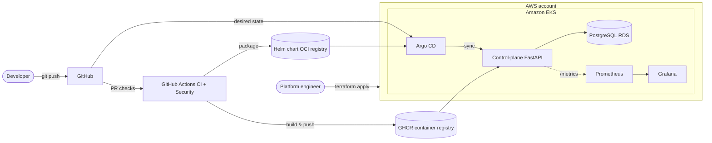

# Enterprise DevOps Platform

[](https://github.com/abhisheksawant52/enterprise-devops-platform/actions/workflows/ci.yml)
[](https://github.com/abhisheksawant52/enterprise-devops-platform/actions/workflows/security.yml)
[](https://www.terraform.io/)
[](https://kubernetes.io/)
[](LICENSE)

A reference architecture and working implementation for an enterprise **CI/CD + GitOps + DevSecOps**
platform. It provisions an Amazon EKS estate with Terraform, runs a FastAPI **control-plane** service
that tracks environments and deployments, packages that service with Helm, delivers it continuously via
Argo CD (GitOps), and gates every change through a DevSecOps pipeline (Ruff, mypy, pytest, Trivy,
Gitleaks, Checkov).

---

## Overview

The platform is the connective tissue between developers pushing code and workloads running in
production. It is deliberately opinionated:

- **Infrastructure as Code** — every AWS resource is declared in Terraform, split into reusable modules
  (`vpc`, `eks`, `irsa`) and composed per-environment (`dev`, `prod`).
- **GitOps as the delivery mechanism** — the cluster's desired state lives in Git; Argo CD reconciles it.
  No `kubectl apply` from laptops.
- **DevSecOps by default** — security scanning is a required status check, not an afterthought.
- **A real control plane** — the FastAPI service exposes an API to register environments, trigger and
  query deployments, and surface health/metrics for observability tooling.

## Architecture



See [`docs/architecture/README.md`](docs/architecture/README.md) for the full C4-style breakdown and
component responsibilities.

## Features

- **Modular Terraform** for VPC, EKS (managed node groups, OIDC provider), and IRSA roles.
- **Multi-environment** promotion with isolated state backends and tfvars (`dev`, `prod`).
- **FastAPI control plane** with typed Pydantic models, a service layer, structured JSON logging, and a
  Prometheus `/metrics` endpoint.
- **Helm chart** with autoscaling (HPA), ingress, probes, `securityContext`, and pod-disruption safety.
- **Kustomize** base + `dev`/`prod` overlays for teams that prefer raw manifests.
- **Argo CD** `Application` and `ApplicationSet` manifests implementing GitOps.
- **CI/CD** pipelines: lint/type-check/test/coverage, container build, security scanning, and tag-driven
  releases that push images and package the Helm chart.
- **Ansible** hardening role for bootstrap/bastion hosts.

## Repository layout

```text
.
├── .github/workflows/   # CI, security scanning, and release pipelines
├── ansible/             # Host hardening role + playbook
├── argocd/              # GitOps Application / ApplicationSet manifests
├── docs/                # Architecture, ADRs, runbooks
├── helm/                # Helm chart for the control-plane service
├── kubernetes/          # Kustomize base + dev/prod overlays
├── scripts/             # Bootstrap and helper scripts
├── src/                 # FastAPI control-plane service (app package)
├── terraform/           # Modular IaC + per-environment composition
└── tests/               # pytest suite (routers + service layer)
```

## Prerequisites

| Tool       | Version   | Purpose                        |
|------------|-----------|--------------------------------|
| Terraform  | >= 1.7    | Provision AWS infrastructure   |
| AWS CLI    | >= 2.15   | Credentials / EKS auth         |
| kubectl    | >= 1.29   | Cluster access                 |
| Helm       | >= 3.14   | Chart packaging / install      |
| Python     | 3.12      | Control-plane service          |
| Docker     | >= 24     | Container builds               |

## Quickstart

### 1. Run the control plane locally

```bash
make install        # create venv and install dependencies
make test           # run the pytest suite with coverage
make run            # start uvicorn on http://localhost:8000
curl localhost:8000/healthz
curl localhost:8000/metrics
```

### 2. Provision infrastructure (dev)

```bash
cd terraform/environments/dev
terraform init -backend-config=backend.hcl
terraform plan  -var-file=dev.tfvars
terraform apply -var-file=dev.tfvars
```

### 3. Deploy via Helm

```bash
helm upgrade --install edp helm/chart \
  --namespace edp-system --create-namespace \
  --values helm/chart/values.yaml
```

### 4. Or hand it to GitOps

```bash
kubectl apply -f argocd/projects/platform.yaml
kubectl apply -f argocd/applications/control-plane-dev.yaml
```

## Environments

| Environment | Cluster            | Terraform workspace              | Argo CD app                 |
|-------------|--------------------|----------------------------------|-----------------------------|
| dev         | `edp-dev`          | `terraform/environments/dev`     | `control-plane-dev`         |
| prod        | `edp-prod`         | `terraform/environments/prod`    | `control-plane-prod`        |

Promotion is Git-driven: a change is merged to `main`, released as a tagged image, and the environment's
Argo CD `Application` is bumped to the new tag via PR.

## Security

- No long-lived cloud credentials in workloads — pods assume IAM roles via **IRSA**.
- Secrets are referenced, never committed; see `*.example` files for the expected shape.
- Every PR runs Trivy (filesystem + image), Gitleaks (secret detection), and Checkov (Terraform).
- Report vulnerabilities per [`SECURITY.md`](SECURITY.md).

## Contributing

Read [`CONTRIBUTING.md`](CONTRIBUTING.md). In short: branch, run `make lint test`, open a PR, and make the
required checks green. Code ownership is defined in [`CODEOWNERS`](CODEOWNERS).

## License

Released under the [MIT License](LICENSE). © 2026 Abhishek Sawant.
